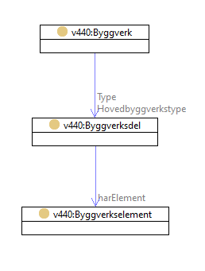
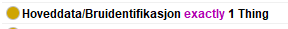
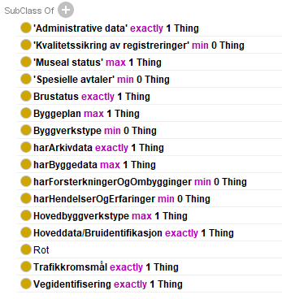
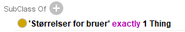
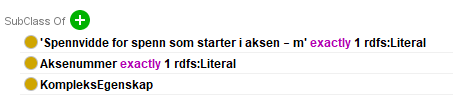
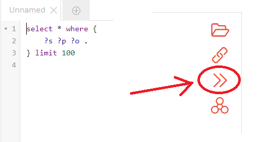

[TOC]

Introduktion
============

Detta dokument beskriver principer för digitaliseringen av *Håndbok v440* med
hjälp av en ontologi utformad enligt principer för den semantiska webben.

Målgruppen är framförallt de som ska läsa/använda ontologin samt de som ska
utveckla den vidare.

Uppbyggnad av Ontologi
======================

Struktur
--------

Ontologin för håndbok v440 har delats upp i två delar:

- **v440-owl.ttl** innehåller klasser, klasstaxonomi (rdfs:subClassOf) samt kodlistor med innehåll
  - Namespace-uri : http://rdf.vegdata.no/v440-owl
  - Namespace-prefix : v440
  - v440-owl.ttl importerar följande ontologier:
    - http://xmlns.com/foaf/spec/ (foaf)
    - http://purl.org/dc/terms (dcterms)
- **v440-brudata-owl.ttl** innehåller definitioner av egenskaper enligt kapitel 7 (Brudata)  samt egenskapernas knytning til klasserna i v440-owl.ttl
  - Namespace-uri : http://rdf.vegdata.no/v440-brudata-owl
  - Namespace-prefix : v440bd
  - v440-brudata-owl.ttl importerar följande ontologier:
    - http://rdf.vegdata.no/v440-owl (v440)
    - http://xmlns.com/foaf/spec/ (foaf)
    - http://purl.org/dc/terms (dcterms)
    - <https://w3id.org/def/basicsemantics-owl> (basicsemantics). Basicsamentics importerar i sin tur ontologier från qudt (http://qudt.org/schema/qudt)
- Båda ontologierna använder dessutom properties från vann (http://purl.org/vocab/vann) för metadata på ontologi-nivå

Principer för ontologin
-----------------------

### Generella egenskaper

#### Namn

Alla klasser och egenskaper har en unik URI. För att ge namn (på norska eller andra språk) använder vi egenskapen `rdfs:label` (t ex `rdfs:label "Vegbru"@no`).

#### Definitioner

För definitioner använder vi `rdfs:comment`. På samma sätt som med rdfs:label kan denna ges på flera språk genom normal språktaggning, t ex `rdfs:comment "Code according to handbook V440"@en ;`.

#### v440-koder

För att bibehålla de koder som v440 anger för klasser, egenskaper och innehåll i kodlistor så har vi definierat ett eget `owl:annotationProperty`:

`:kode`
`  	rdf:type owl:AnnotationProperty ;`
`rdf:type owl:DatatypeProperty ;`
`rdfs:comment "Code according to handbook V440"@en ;`
`rdfs:comment "Kod enligt håndbok V440"@no ;`
`rdfs:label "V440-kode"@no ;`
`
  rdfs:label "v440 code"@en ;`

Detta innebär att vi till klasser och properties med hjälp av v440:kode kan knyta v440-kode. Ett exempel:
`:Kassebru_konstant_hoyde_skra_vegger`
  `rdf:type owl:Class ;`
  `:avsnitt "V-6.1" ;`
  `:kapitel "V-6" ;`
  `**:kode "415"^^xsd:int ;**`
  `rdfs:label "Kassebru, konstant høyde, skrå vegger"@no ;`
  `rdfs:subClassOf :Kassebru_konstant_hoyde ;`

Dessa koder finns i ontologin överallt där en kod definierats i v440.

#### Andra referenser till handboken

För att kunna hänvisa till kapitel och avsnitt i v440 så har vi även introducerat annotation properties för dessa:

`:kapitel`
  `rdf:type owl:AnnotationProperty ;`
  `rdfs:comment "Kapitel i Håndbok v440"@no ;`
  `rdfs:label "Kapitel"@no ;`
`.`

`:avsnitt`
  `rdf:type owl:AnnotationProperty ;`
  `rdfs:comment "Avsnitt i Håndbok v440"@no ;`
  `rdfs:label "Avsnitt"@no ;`
`.`

Exempel:

`:Kassebru_konstant_hoyde_skra_vegger`
  `rdf:type owl:Class ;`
  `**:avsnitt "V-6.1" ;**`
  `**:kapitel "V-6" ;**`
  `:kode "415"^^xsd:int ;`
  `rdfs:label "Kassebru, konstant høyde, skrå vegger"@no ;`
  `rdfs:subClassOf :Kassebru_konstant_hoyde ;`

### Taxonomi (hierarki typ-av)

Tolkningen av håndbok v440 har anpassats till grundstrukturen i [ISO 12006-2](https://www.iso.org/obp/ui/#iso:std:iso:12006:-2:ed-2:v1:en). Standarden innehåller ett antal begrepp relevanta för håndbok v440. Nedanstående tabell visar hur de olika begreppen förhåller sig:

| Begrepp i ISO 12006-2                                        | Motsvarande begrepp i V440                                   |
| ------------------------------------------------------------ | ------------------------------------------------------------ |
| **construction entity** an independent unit of the *built environment* with a characteristic spatial structure, serving at least one user activity or function | **Brukategorier** *"Prinsippet for å klassifisere et byggverk i en bestemt kategori er at hovedfunksjonen til byggverket lar seg identifisere. Som nevnt ovenfor kan et byggverk kun tilhøre én kategori, men den kan bestå av flere typer."* |
| **construction entity part** constituent of a *construction entity* | **Brutyper** *"Ved klassifisering av byggverk i vegnettet bestemmes først kategori ut fra hvilken funksjon byggverket har i forhold til vegen det betjener. Deretter bestemmes byggverkets type ut fra hvordan den fysisk og teknisk oppfyller denne funksjonen."* |
| **construction element** constituent of a *construction entity* with a characteristic technical function, form or position | **Bruelementer** *"For å beskrive byggverkene i detalj deles de inn i hensiktsmessige mindre deler eller komponenter som kalles elementer."* |
| **construction property**  property characterizing a *construction object* | **Kapitel 7 Brudata**                                        |

En taxonomi innebär att vi bygger en trädstruktur av specialiseringar, dvs generella begrepp högst upp och mera specifika begrepp ju längre ner i strukturen man kommer. Hierarkin byggs genom att man använder predikatet `rdfs:subClassOf` mellan den specifika klassen och den generellare. Formellt innebär detta att en instans av den specifika klassen också alltid, per definition, är en instans av den generellare klassen.

Utgående från detta så har vi valt att bygga taxonomin på följande sätt:

- **owl:Thing**
  - **v440:Root**
    - **v440:Byggverk** - Motsvarar indelningen i brukategorier enligt v440
      - De olika kategorierna som subklasser till v440:Byggverk.
      - Beroende på att vi vill kunna knyta egenskaper på ett entydigt sätt (se kapitel egenskaper) så har en extra nivå "Ordinær bru i dagen" införts.  T ex beskrivs i kapitel 7.9.1 att *"Disse størrelsene gjelder for Kategori 1-Vegbruer, 3-G/S-bruer og 8-Jernbanebruer, dvs. ordinære bruer i dagen."*. Detta har inneburit att klasserna Vegbru, Jernbanebru och G/S Bru är subklasser till "Ordinær bru i dagen".
    - **v440:Byggverksdel** - Motsvarar indelningen i brutyper enligt v440
      - De olika brutyperna beskrivs som subklasser till v440:Byggverksdel. Varje ny nivå innebär att en ny subklass-nivå skapas. Ett exempel kan vara (varje nivå innebär ytterligare specialisering)
        - **v440:Byggverksdel**
          - **v440:Kassebru** (subklass till v440:Byggverksdel)
            - **v440:Kassebru_konstant_hoyde** (subklass till v440:Kassebru)
              - **v440:Kassebru_konstant_hoyde_skra_vegger** (subklass till v440:Kassebru_konstant_hoyde)
    - **v440:Byggverkselement** - motsvarar indelningen i byggverkselement
      - De olika typerna av byggverkselement beskrivs i en subklass-hierarki enligt v440. Varje ny nivå innebär att en ny subklass-nivå skapas. Ett exempel kan vara
        - **v440:Byggverkselement**
          - **v440:Grunn_og_underbygning_element** (subklass till v440:Byggverkselement)
            - **v440:Grunnen** (subklass till v440:Grunn_og_underbygning_element)
              - **v440:Grunnen_Peler** (subklass till v440:Grunnen)
    - **v440bd:KompleksEgenskap** - används för alla egenskaper i kapitel 7 - Brudata som är sammansatta av sub-egenskaper. Även här byggs vid behov en taxonomi-struktur. Ett exempel kan vara:
      - **v440bd:KompleksEgenskap**
        - **v440bd:Akse**
        - **v440bd:Materialdefinisjon**
          - **v440bd:Materialdefinisjon_Betong**
          - **v440bd:Materialdefinisjon_Stal**
          - **v440bd:Materialdefinisjon_Tre**
          - **v440bd:Materialdefinisjon_Andre**

### Meronomi (hierarki består-av)

Taxonomin beskriver förhållande mellan generella och specifika begrepp medan meronomin beskriver hur olika delar kan sättas samman i en består-av struktur. Här har man stora möjligheter att i ontologin begränsa urvalet av delar som något kan bestå av. Dock har vi ännu så länge gjort detta enkelt, utan stora restriktioner. Grovt sett ser meronomin ut på följande sätt:

Som synes är `v440:Byggverk` och `v440:Byggverksdel` länkade på två sätt, både via `v440bd:Type` och `v440bd:Hovedbyggverkstype`. Detta är för att en byggverksdel utgör hovedbyggverkstype när flera typer ingår i ett byggverk enligt v440 och vi vill kunna skilja på dessa. `v440:Byggverksdel` innehåller i sin tur `v440:Byggverkselement` via `v440bd:harElement`.

Detta innebär att vi kan bygga en struktur enligt detta exempel:

`:Vegbru_1`
  `rdf:type v440:Vegbru ;`
  `v440bd:Hovedbyggverkstype :Platebru_massiv_BH5_med_overliggende_forsterkning_1 ;`
  `v440bd:Type :Ribbeplatebru_1 ;`
`.`

`:Platebru_massiv_BH5_med_overliggende_forsterkning_1`
  `rdf:type v440:Platebru_massiv_BH5_med_overliggende_forsterkning ;`
  `v440bd:harElement :Grunnen_Armert_jord_1 ;`
`.`

`:Grunnen_Armert_jord_1`
  `rdf:type v440:Grunnen_Armert_jord ;`
`.`

`v440bd:Hovedbyggverkstype`, `v440bd:Type` och `v440bd:harElement` är alla definierade som sub-properties till `basicsemantics:hasPart`. Detta innebär att en reasoner kan automatiskt härleda följande triples till de ovan:

`:Vegbru_1`
  `bs:hasPart :Platebru_massiv_BH5_med_overliggende_forsterkning_1, :Ribbeplatebru_1 ;`
`.`

`:Platebru_massiv_BH5_med_overliggende_forsterkning_1`
  `bs:hasPart :Grunnen_Armert_jord_1 ;`
`.`

### Kodlistor

Kodlistor är listor av fördefinierade värden (eller koder), t ex för Statiskt system. Alla kodlisteklasser har en gemensam basklass `v440:Kodeliste`och är utformade på samma sätt men med olika innehåll. Kodlistan som helhet är definierad som en klass, t ex:

`v440:Statisk_system`
  `rdf:type owl:Class ;`
  `v440:avsnitt "V-6" ;`
  `v440:kapitel "V-6" ;`
  `v440:kode "-" ;`
  `rdfs:label "Statisk system"@no ;`
  `rdfs:subClassOf :Kodeliste ;`
`.`

Alla valbara värden (eller koder) är sedan definierade som instanser/medlemmar, i ontologin, av kodlisteklassen:

`v440:Statisk_system_Fritt_opplagt_system`
  `rdf:type :Statisk_system ;`
  `v440:avsnitt "V-6.2" ;`
  `v440:kapitel "V-6" ;`
  `v440:kode "1"^^xsd:int ;`
  `rdfs:label "Fritt opplagt system"@no ;`
`.`

`v440:Statisk_system_Kontinuerlig_system`
  `rdf:type :Statisk_system ;`
  `v440:avsnitt "V-6.2" ;`
  `v440:kapitel "V-6" ;`
  `v440:kode "2"^^xsd:int ;`
  `rdfs:label "Kontinuerlig system"@no ;`
`.`

`Osv...`

Detta har fördelen att vi till varje fördefinierat värde (eller "kod") har möjlighet att knyta information som språkanpassade namn och definitioner eller länka mot andra system. Normalt sett bör man hänvisa till en kod i kodlistan genom sin unika URI, t ex `v440:Statisk_system_Kontinuerlig_system` eftersom detta ger en definitiv hänvisning till korrekt definition som hittas i ontologin. Men som synes lagras även motsvarande sifferkod från v440 i ontologin.

### Egenskaper

I OWL finns det två typer av egenskaper: `owl:DatatypeProperty` och `owl:ObjectProperty`. `owl:DatatypeProperty` används när objektet i en trippel med detta property utgörs av en literal, dvs någon typ av värde (heltal, textsträng, datum etc).

`owl:ObjectProperty` används när objektet i en trippel med detta property utgörs av ett annat objekt (dvs en URI). I v440 beskrivs egenskaper i kapitel 7 - Brudata oftast som sammansatta av sub-egenskaper. Exempelvis har vi kapitel 7.3 Hoveddata/Bruidentifikasjon som beskriver egenskaperna Nummer, Navn och Bygd.

Vi har valt att definiera alla egenskaper och dess kopplingar till objekt i en separat ontologi http://rdf.vegdata.no/v440-brudata-owl (prefix v440bd:). Vi har även försökt bevara strukturen i handboken. Det har inneburit att alla sammansatta egenskaper (egenskaper som bryts ner i ytterligare sub-attribut) definieras som klasser. Alla dessa klasser är subklasser till klassen `v440bd:KompleksEgenskap`.

#### Komplexa egenskaper

Den sammansatta egenskapen definieras som en klass enligt exempel nedan:

`v440bd:Hoveddata_Bruidentifikasjon`
  `rdf:type owl:Class ;`
  `v440:kapitel "7.3" ;`
  `rdfs:label "Hoveddata/Bruidentifikasjon"@no ;`
  `rdfs:subClassOf v440bd:KompleksEgenskap ;`
`.`

För var och en av dessa klasser finns ett motsvarande owl:ObjectProperty, t ex:

`v440bd:harBruidentifikasjon` (anm: kanske namnet skulle vara v440bd:harHoveddata_Bruidentifikasjon)
  `rdf:type owl:ObjectProperty ;`
  `v440:kapitel "7.3" ;`
  `rdfs:domain v440:Byggverk ;`
  `rdfs:label "Hoveddata/Bruidentifikasjon"@no ;`
  `rdfs:range v440bd:Hoveddata_Bruidentifikasjon ;`
  `rdfs:subPropertyOf bs:hasProperty ;`
`.`

Som synes används `rdfs:domain` och `rdfs:range` för att koppla samman egenskapsklassen (`v440bd:Hoveddata_Bruidentifikasjon`) med objektklassen (`v440:Byggverk`). Detta görs konsekvent i ontologin. Detta anger alltså att en trippel med predikatet `v440bd:harBruidentifikasjon` har en instans av typen `v440:Byggverk` som subjekt och en instans av `v440bd:Hoveddata_Bruidentifikasjon` som objekt.

Restriktioner för kardinaliteter (dvs hur många objekt av en viss typ som får förekomma för samma subjekt) specificeras i domän-klassen på följande sätt:

`v440:Byggverk`
  `rdfs:subClassOf [`
      `rdf:type owl:Restriction ;`
      `owl:cardinality "1"^^xsd:nonNegativeInteger ;`
      `owl:onProperty v440bd:harBruidentifikasjon ;`
    `] ;`
`.`

Motsvarande i t ex Protege ser ut så här för klassen `v440:Byggverk`:

Detta följer en annan syntax (Manchester syntax) och är mera praktisk och överskådlig än OWL i ren "trippelform". Det kan tyckas konstigt att man i OWL uttrycker denna begränsning som en subklass, men förklaringen är att man ska läsa detta som att en restriktion som innebär att det ska finnas exakt en förekomst av egenskapen `v440bd:harBruidentifikasjon` betraktas som en klass (=mängd). Detta är alltså mängden av alla objekt som har exakt en förekomst av egenskapen. Eftersom `v440:Byggverk` är en subklass till nämnda klass så innebär det att ett byggverk MÅSTE HA exakt en förekomst av egenskapen `v440bd:harBruidentifikasjon` eftersom en instans av en subklass även tillhör basklassen. Det finns mera "finesser" kring detta som vi inte går in på mera här.

Den fullständiga beskrivningen av klassen `v440:Byggverk` ser ut så här (i Protege):

Detta är alltså alla egenskaper som kan knytas till ett byggverk. Samtliga av dessa gäller även samtliga subklasser till byggverk. Eftersom t ex `v440:Vegbru` är en subklass till `v440:Byggverk` så gäller alltså detta även för vegbruer. En vegbru har dessutom ytterligare en egenskap som är unik för just vegbruer:

Detta är alltså en egenskap som tillkommer för vegbru utöver de som angivits generellt för byggverk.

#### Enkla egenskaper

En enkel egenskap definieras med hjälp av owl:DatatypeProperty, t ex:

`v440bd:Aksenummer`
  `rdf:type owl:DatatypeProperty ;`
  `rdfs:comment "Aksenummereringen skal normalt følge stigende kilometreringsretning på vegen og kan starte med 0 eller 1, men dersom oversiktstegning viser annen retning følges tegningen."@no ;`
  `rdfs:domain v440bd:Akse ;`
  `rdfs:label "Aksenummer"@no ;`
  `rdfs:range xsd:integer ;`
`.`

Detta anger att egenskapen `v440:Aksenummer` ska ha ett heltalsvärde som objekt i en trippel eftersom `rdfs:range` hänvisar till `xsd:integer`.

Enkla egenskaper kan användas direkt från en objektklass eller direkt från en egenskapsklass på samma sätt som beskrivits ovan. Om vi för fallet ovan tittar på definitionen av `v440bd:Akse` så ser den ut så här:

`v440bd:Akse`
  `rdf:type owl:Class ;`
  `v440:kapitel "7.9.6" ;`
  `rdfs:comment """Akser benyttes til å stedfeste beliggenheten av bruas hovedelementer og danner utgangspunktet for registrering av bæresystemets spennvidder. Akser må derfor angis slik at korrekte spennvidder blir registrert.`
`Identifisering av akser skjer ved tildeling av et entydig aksenummer. Aksenummereringen skal normalt følge stigende kilometreringsretning på vegen og kan starte`
`med 0 eller 1, men dersom oversiktstegning viser annen retning følges tegningen."""@no ;`
  `rdfs:label "Akse"@no ;`
  `rdfs:subClassOf v440bd:KompleksEgenskap ;`
  `rdfs:subClassOf [`
      `rdf:type owl:Restriction ;`
      `owl:cardinality "1"^^xsd:nonNegativeInteger ;`
      `owl:onProperty v440bd:Aksenummer ;`
    `] ;`
  `rdfs:subClassOf [`
      `rdf:type owl:Restriction ;`
      `owl:cardinality "1"^^xsd:nonNegativeInteger ;`
      `owl:onProperty v440bd:Spennvidde ;`
    `] ;`
`.`

Eller i protege:

Detta betyder alltså att en `v440bd:Akse` ska ha exakt en förekomst av `v440bd:Aksenummer` samt exakt en förekomst av `v440bd:Spennvidde`

#### Kodelister som egenskap

Att referera kodelister blir ingen skillnad mot ovan. För varje kodeliste (som är en klass, t ex `v440:Statisk_system`) så finns motsvarande owl:ObjectProperty (i detta fall `v440bd:StatiskSystem`). Eftersom det finns en mängd fördefinierade instanser av statiskt system så kan man referera någon av dessa, t ex:

`:GrundegenskaperVanligBru_1`
  `rdf:type v440bd:GrundegenskaperVanligBru ;`
  `v440bd:StatiskSystem v440:Statisk_system_Kontinuerlig_system ;`
`.`

Åtkomst av ontologin
====================

Nedladdning
-----------

Nedladdning av ontologi kan göras genom att använda ontologins URI, dvs http://rdf.vegdata.no/v440-owl eller http://rdf.vegdata.no/v440-brudata-owl med header *accept = text/turtle* (när andra format, t ex json-ld finns tillgängliga ska även motsvarande accept-headers fungera). Om man bara använder URI:n i en web-läsare eller använder *accept = text/html* fås en html-representation av ontologin. Ett kodexempel för nedladdning med C# visas nedan.

SPARQL endpoint
---------------

Ett triple-store finns här: http://rdfspatial.vegdata.no/. Denna ger läsåtkomst via ett web-gränssnitt. Om man ska komma åt motsvarande SPARQL endpoint från ett program så gäller att man kompletterar URI:n med "/repositories/v440" . Den fullständiga URI:n för denna SPARQL endpoint blir alltså http://rdfspatial.vegdata.no/repositories/V440.

Anm: För närvarande fungerar inte ovanstående adress utan man får lov att använda denna istället från program: http://npra.io:7200/repositories/V440

SPARQL-protokollet körs över http och beskrivs bland annat här: https://www.w3.org/TR/sparql11-protocol/

### Några typiska SPARQL-frågor

Nedan följer ett antal frågor som ger en uppfattning om hur ontologin kan hanteras via SPARQL.

#### Alla klasser som är byggverk (alla nivåer - för endast första nivån ta bort '+')

`PREFIX rdfs: <http://www.w3.org/2000/01/rdf-schema#>`
`PREFIX owl: <http://www.w3.org/2002/07/owl#>`
`prefix onto:<http://www.ontotext.com/>`
`prefix v440:<http://www.vegvesen.no/def/test/v440-owl#>`
`prefix v440bd:<http://www.vegvesen.no/def/test/v440-brudata-owl#>`
`select distinct ?class ?code ?name`
`where`
`{`
	`?class rdfs:subClassOf+ v440:Byggverk .`
	`?class rdfs:label ?name .`
	`?class v440:kode ?code .`
`}`

#### Hitta alla (relevanta) properties för en klass (exempel för v440:Vegbru)

`PREFIX rdfs: <http://www.w3.org/2000/01/rdf-schema#>`
`PREFIX owl: <http://www.w3.org/2002/07/owl#>`
`prefix onto:<http://www.ontotext.com/>`
`prefix v440:<http://www.vegvesen.no/def/test/v440-owl#>`
`prefix v440bd:<http://www.vegvesen.no/def/test/v440-brudata-owl#>`
`select distinct ?property ?name ?type`
`where`
`{`
    `?property rdfs:domain ?class .`
    `?property rdfs:label ?name .`
    `v440:Vegbru rdfs:subClassOf* ?class.`
    `OPTIONAL {?property rdfs:range ?type .}`
    `OPTIONAL {?property rdfs:subPropertyOf*/rdfs:range ?type .}`
`}`

#### Hitta alla (relevanta) properties för ett komplext property (exempel för v440bd:Vegidentifisering)

`PREFIX rdfs: <http://www.w3.org/2000/01/rdf-schema#>`
`PREFIX owl: <http://www.w3.org/2002/07/owl#>`
`prefix onto:<http://www.ontotext.com/>`
`prefix v440:<http://www.vegvesen.no/def/test/v440-owl#>`
`prefix v440bd:<http://www.vegvesen.no/def/test/v440-brudata-owl#>`
`select distinct ?property ?name ?descr ?type`
`where`
`{`
    `?property rdfs:domain ?class .`
    `?property rdfs:label ?name .`
    `?property rdfs:comment ?descr .`
    `v440bd:Vegidentifisering rdfs:subClassOf* ?class.`
    `OPTIONAL {?property rdfs:range ?type .}`
    `OPTIONAL {?property rdfs:subPropertyOf*/rdfs:range ?type .}`
    `OPTIONAL {?type rdf:type ?dt .}`
`}`

#### Hämta innehåll i kodlista (exempel för v440:Vegdata_Kode_for_vegkategori)

`PREFIX rdfs: <http://www.w3.org/2000/01/rdf-schema#>`
`PREFIX owl: <http://www.w3.org/2002/07/owl#>`
`prefix onto:<http://www.ontotext.com/>`
`prefix v440:<http://www.vegvesen.no/def/test/v440-owl#>`
`prefix v440bd:<http://www.vegvesen.no/def/test/v440-brudata-owl#>`
`select distinct ?uri ?code ?name`
`where`
`{`
    `?uri a v440:Vegdata_Kode_for_vegkategori .`
    `?uri v440:kode ?code.`
    `?uri rdfs:label ?name.`
`}`

Kodexempel (C#)
---------------

### Inledning

För C# finns ett antal bibliotek. Ett av dessa är dotNetRDF (https://github.com/dotnetrdf/dotnetrdf) som fungerar bra, har bra dokumentation och en snäll licens (MIT). De exempel som visas nedan använder sig av detta bibliotek.

### Hämtning av fil

        private static void GetV440()
        {
            try
            {
                using (HttpClient client = new HttpClient())
                {
                    client.DefaultRequestHeaders.Add("accept", "text/turtle");
                    HttpResponseMessage response = client.GetAsync("http://rdf.vegdata.no/V440/v440-owl").Result;
                    string result = response.Content.ReadAsStringAsync().Result;
                    TurtleParser ttlparser = new TurtleParser();
                    IGraph g = new Graph();
                    StringReader sr = new StringReader(result);
                    ttlparser.Load(g, sr);
                    foreach (Triple t in g.Triples)
                    {
                        Console.WriteLine(t.ToString());
                    }
                    Console.ReadLine();
                }
            }
            catch (Exception ex)
            {
                Console.WriteLine(ex.Message);
            }
        }
### Anrop av SPARQL endpoint

        private static void TestQuerySVVV440()
        {
            try
            {
                //Define a remote endpoint
                SparqlRemoteEndpoint endpoint = new SparqlRemoteEndpoint(new Uri("http://npra.io:7200/repositories/V440"));
                // Fungerar ej            SparqlRemoteEndpoint endpoint = new SparqlRemoteEndpoint(new Uri("http://rdfspatial.vegdata.no/repositories/V440"));
                //Make a SELECT query against the Endpoint
                SparqlResultSet results = endpoint.QueryWithResultSet("SELECT ?Class FROM <http://www.ontotext.com/explicit> WHERE {?Class rdfs:subClassOf <http://rdf.vegdata.no/v440-owl#Byggverk>}");
                Console.WriteLine("Subklasser till Byggverk...");
                foreach (SparqlResult result in results)
                {
                    Console.WriteLine(result.Value("Class"));
                }
                Console.WriteLine("DESCRIBE v440:Vegbru...");
                IGraph g = endpoint.QueryWithResultGraph("DESCRIBE <http://rdf.vegdata.no/v440-owl#Vegbru>");
                foreach (Triple t in g.Triples)
                {
                    Console.WriteLine(t.ToString());
                }
                Console.ReadLine();
            }
            catch (Exception ex)
            {
                Console.WriteLine(ex.Message);
            }
        }
Nedan visas även ett exempel på anrop av den SPARQL endpoint som erbjuds av DBPedia (Wikipedia):

        private static void TestQueryDBPedia()
        {
            try
            {
                //Define a remote endpoint
                //Use the DBPedia SPARQL endpoint with the default Graph set to DBPedia
                SparqlRemoteEndpoint endpoint = new SparqlRemoteEndpoint(new Uri("http://dbpedia.org/sparql"), "http://dbpedia.org");

                //Make a SELECT query against the Endpoint
                SparqlResultSet results = endpoint.QueryWithResultSet("SELECT DISTINCT ?Concept WHERE {[] a ?Concept}");
                foreach (SparqlResult result in results)
                {
                    Console.WriteLine(result.ToString());
                }
                Console.ReadLine();
            }
            catch (Exception ex)
            {
                Console.WriteLine(ex.Message);
            }
        }
## Länkning av andra ontologier

### Inledning

Som stöd för att kunna "konfigurera" mappningar mellan olika ontologier finns ett antal standardiserade definitioner i owl och rdfs. Data (tripplar) som beskriver mappningar mellan ontologier bör helst läggas som separata ontologier som brukar kallas *Alignment ontologies* eller *Linking Rule Sets* (LRS).

Idealt så har man tillgång till en programvara som klarar att tolka dessa beskrivningar, en så kallad [reasoner](https://en.wikipedia.org/wiki/Semantic_reasoner), vilket innebär att man kan få en automatisk mappning att ske baserat på informationen i ett LRS. Eftersom även dessa mappningar uttrycks som tripplar i en ontologi så har man naturligtvis möjlighet att utföra denna "reasoning" på egen hand baserat på den definierade logiken.

Mycket kortfattat går reasoning ut på att, baserat på definierad logik, härleda nya tripplar (inferred triples) baserat på redan existerande tripplar (asserted triples). Som ett enkelt exempel kan vi ha följande definierade tripplar (Asserted triples).

**Asserted triples - Dataset:**

`:obj_1 rdf:type ont1:MyClass .`
`:obj_1 ont1:myProperty "123" .`

**Asserted triples - Linking Rule Set:**

`ont1:MyClass owl:equivalentClass ont2:AnotherClass .`
`ont1:myProperty owl:equivalentProperty ont2:AnotherProperty .`

En reasoner kan baserat på ovanstående härleda följande.

**Inferred triples:**

`:obj_1 rdf:type ont2:AnotherClass .`
`:obj_1 ont2:AnotherProperty "123" .`

Den programvara som för närvarande används som triple store för v440 har inbyggd reasoning. Denna aktiveras eller avaktiveras i program genom att man lägger till följande i sin SPARQL-fråga:

SELECT ?x **FROM** **<http://www.ontotext.com/explicit>** WHERE... : returnerar de tripplar som fördefinierats i databasen (asserted triples)

SELECT ?x **FROM** **<http://www.ontotext.com/implicit>** WHERE... : returnerar de tripplar som härletts (inferred triples)

Motsvarande funktionalitet finns i web-gränssnittet om man klickar på den ikon som markerats i bilden nedan:

Många triple stores stödjer reasoning. Det C#-bibliotek som refereras ovan har ett interface (*IInferenceEngine*). För närvarande finns implementation av rdfs-, skos- och "simple N3"-resoning.

Man kan även använda SPARQL CONSTRUCT (https://www.w3.org/TR/rdf-sparql-query/#construct) eller exempelvis SPIN (https://spinrdf.org/) för att göra mappningar, men det beskrivs inte närmare här.

### Några vägar för länkning av ontologier

Nedan följer några sätt som kan användas för att länka klasser och egenskaper mellan ontologier.

`owl:equivalentClass` : anger att subjektklass och objektklass har samma extension. Används för att ange att två olika klasser är ekvivalenta. OBS att en klass i OWL också kan definieras som en egenskaps-restriktion med hjälp av `owl:Restriction` (t ex alla Byggverkselement med material=Stål) vilket innebär att det går att definiera mappningar även baserat på properties.

Exempel: `A owl:equivalentClass B` betyder att en instans som tillhör A (eller B) även tillhör B (eller A)

`rdfs:subClassOf` : anger att en instans av subklassen (subjektet) även är en instans av basklassen (objektet). Detta kan t ex användas när man har en mera detaljerad klassdefinition, t ex i ett projekt, av ett objekt som finns definierad i v440 och vill kunna mappa till det närmaste begreppet i v440.

Exempel : `A rdfs:subClassOf B` betyder att en instans som tillhör A även tillhör B. Däremot kan man inte säga att alla B tillhör A.

Motsvarande kan även göras för properties.

`owl:equivalentProperty` : anger att subjektproperty och objektproperty har samma extension

Exempel : `A owl:equivalentProperty B` betyder att A och B är ekvivalenta och att alla resurser som länkats med A även är länkade med B eller vice versa.

`rdfs:subPropertyOf` : anger att alla resurser som länkats med subjektpropertyt även är länkade med objektpropertyt

Exempel : `A rdfs:subPropertyOf B` betyder att alla resurser som länkats med A även är länkade med B. Däremot kan man inte säga att alla som länkats med B även är länkade med A.

För att länka instanser kan man beroende på omständigheterna definiera egna properties, om länkarna har en specifik semantik. Ett property som finns som standard i OWL är `owl:sameAs` som indikerar att subjekt och objekt refererar till samma sak.

Exempel : `A owl:sameAs B` betyder att A och B refererar till samma sak, t ex en Vegbru i system A och en Vegbru i system B.

`owl:sameAs` kan även användas för att länka innehållet i kodlistor i v440 (som utgörs av instanser) med motsvarande definitioner någon annanstans.

OBS att ovanstående fungerar så länge man kan hitta enkla mappningar mellan objekt eller egenskaper. I mera komplicerade fall, t ex att det property man ska mappa till är sammansatt av eller beräknas från flera properties så behöver man använda t ex SPARQL CONSTRUCT eller SPIN. En fördel med SPIN är att det bygger på SPARQL men kan lagras som tripplar vilket innebär att mappningsdefinitionerna ligger som data och inte i kod.

Förhoppningsvis kommer det att finnas något eller några mindre exempel på mappningar tillgängliga på samma server som ontologierna.

### Vad kan detta vara bra för?

Naturligtvis kan det finnas fördelar i att mappningsdefinitioner definieras på ontologi-nivå och därmed blir konfigurerbara istället för hårdkodade i applikationer.

Uppenbara use-cases för detta kan t ex vara:

- Mappningar mellan olika standarder, t ex v440 och IFC eller v440 och NVDB
- Mappningar mellan standard och egen programvara
  - T ex om man har egna begrepp för Byggverk etc så kan det vara till hjälp att definiera hur dessa hänger samman med exempelvis v440
