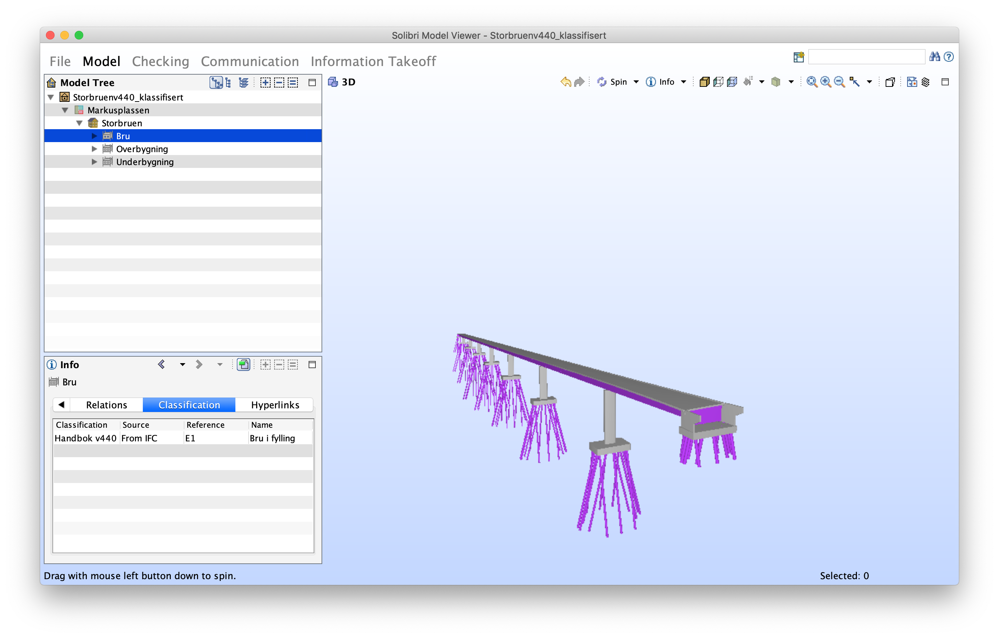

# Vedlagt script klassifiserer Storbruen.ifc med v440

Tar inn Storbruen.ifc og legger til v440 koder. Kodene er valgt ut i samarbeid med Bjørnar Markussen.

Klassifisert fil, Storbruenv440_klassifisert.ifc, finnes under modellfiler. Denne har klassifikasjon lagt til iht. NS8360 for material og klasse iht. v440.

Bildet under viser hvordan klassifikasjonen vises i Solibri.

Scriptet ligger ved som jupyter notebook. Koden kan også kjøres i egne filer ved å importere requests og [ifcopenshell](http://ifcopenshell.org/).

Lær mer om bruk av ifcopenshell og python på [ifcopenshell academy](http://academy.ifcopenshell.org/)
